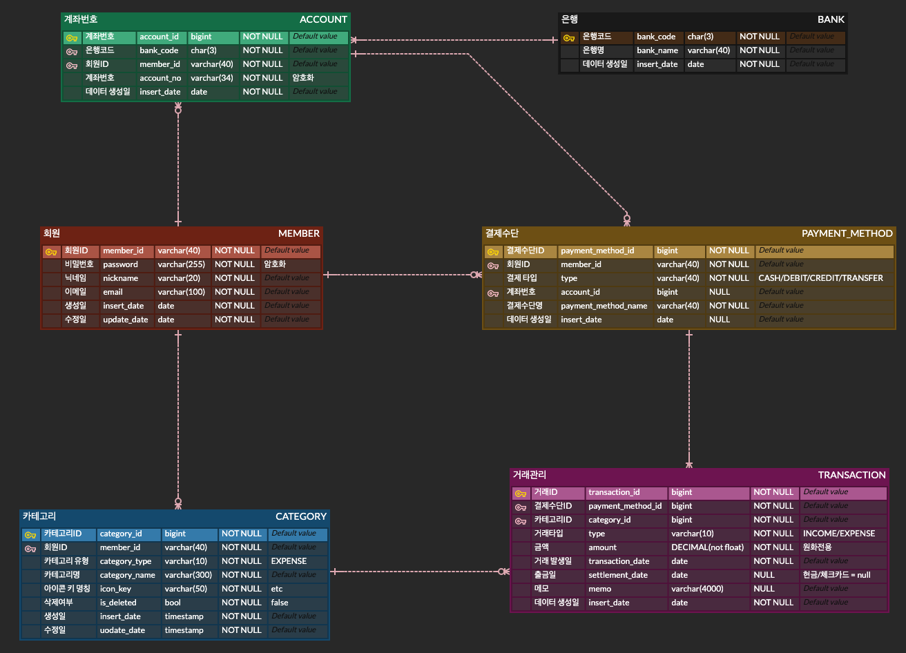

# 🏠 살림 (Salim)

> 한국 가정을 위한 가계부 웹 애플리케이션

## 🛠 기술 스택

| 분류 | 기술 |
|------|------|
| Backend | Spring Boot 4.1.x, Spring Security, JPA |
| Database | PostgreSQL |
| Frontend | Thymeleaf, Thymeleaf Layout Dialect, Tabler UI, ApexCharts |
| Auth | JWT (jjwt) |
| Infra | AWS (예정), GitHub Actions CI/CD (예정) |

## 📐 ERD

## ✅ 주요 기능

- [x] 회원가입 / 로그인 (JWT + HttpOnly Cookie 기반 인증)
- [x] 카테고리 관리
- [ ] 계좌 관리
- [ ] 결제수단 관리
- [ ] 거래내역 관리
- [ ] 대시보드
- [ ] 이메일 인증
- [ ] AI 챗봇 (자연어 기반 지출 조회)
- [ ] OAuth2 소셜 로그인

## 📝 트러블슈팅 & 기술적 의사결정

개발 과정의 문제 해결 및 의사결정 기록은 Notion에 정리했습니다.

👉 [Notion 바로가기](https://app.notion.com/p/e608ceb9043383b0a55481b8298473e1?source=copy_link)

## 📖 API 명세

Swagger UI를 통해 확인 가능합니다. (예정)

## 🚀 실행 방법

추후 배포 완료 후 작성 예정입니다.
